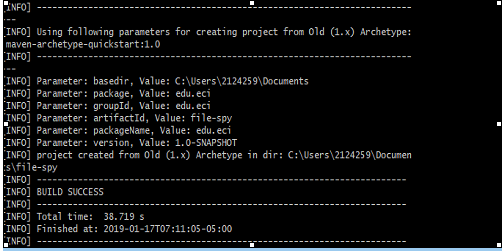
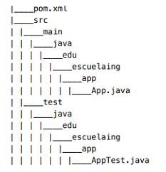
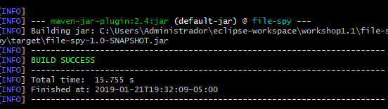
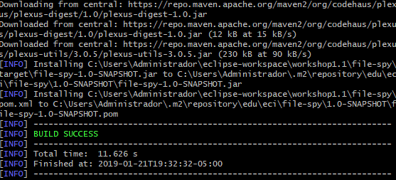
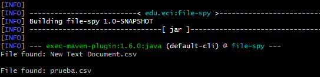

### Maven Basic Concepts
- The result of the command ”mvn archetype:generate -B -DgroupId=edu.eci -DartifactId=file-spy” explain these parameters.
	- 
- Parameter basedir: project location
- Parameter package: take the compile code and package it in a format.
- Parameter groupid: identifies the project
- Parameter artifactid: if the name of the jar
- Parameter version: project version
- The option -B disable the output color.
- The option -D define the system properties.
- The content of the directory have a pom.xml, and the folders that java create with the parameters
	- 
 
### POM FILES
-The word SNAPSHOT means the version of the project that is  in development but the word SNAPSHOT is not important for maven.
-Pom packaging is simply a specification that is used to aggregate another project, it’s not a plugin is a phase.  
-The dependency plugin provides the capability to manipulate artifacts and defines a set of dependencies that the project will fetch from the Maven Repository

### Dependency Management

- I add the `tika-core` dependency into the tag of `dependencies` in the `pom.xml` file, the command  `tika-core` is present below:

	<dependency>
		<groupId>org.apache.tika</groupId>
		<artifactId>tika-core</artifactId>
		<version>1.20</version>
	</dependency>
Then, i add another pluggin in the `pom.xml` where i change the java version for building the project to 1.8 using this comand below:
		
    <build>
	    <plugins>
    		<plugin>
    			<groupId>org.apache.maven.plugins</groupId>
    			<artifactId>maven-compiler-plugin</artifactId>
    			<configuration>
    				<source>1.8</source>
    				<target>1.8</target>
    			</configuration>
    		</plugin>
    	</plugins>
    </build>
   Later, i add the class `FileSpy` replacing the the app class provided in the maven project.
   
### Building Lifecycles and Plugins

 - The default lifecycle handles your project deployment, the clean lifecycle handles project cleaning, while the site lifecycle handles the creation of your project's site documentation.
 - `mvn compile`
	 - 
	 - this command is using for compile the source code of the project
	 - `Transitive dependencies` are dependencies that are dependencies of your direct dependencies.
 - `mvn package`
	- 
	- This command is using to take the compiled code and package it in its distributable format. 
 - `mvn install`
	 - 
	 - This command is usuing for install the package into the local repository, for use as a dependency in other projects locally
	 - 
Then I create a new project in the same project  called `another-maven-project`, I will use `file-spy`as a dependency and execute it and I add the same `pom.xml`using as before with the `file-spy` dependency present bellow:

    <dependency>
    	<groupId>edu.eci</groupId>
    	<artifactId>file-spy</artifactId>
    	<version>1.0-SNAPSHOT</version>
    </dependency>
Then i  execute the file-spy application using this command `mvn exec:java -Dexec.mainClass="edu.eci.FileSpy"`
- 
   

 
 
